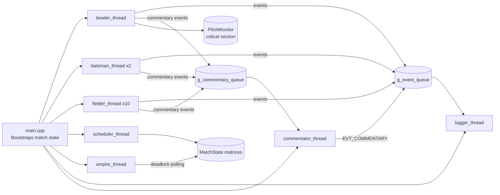
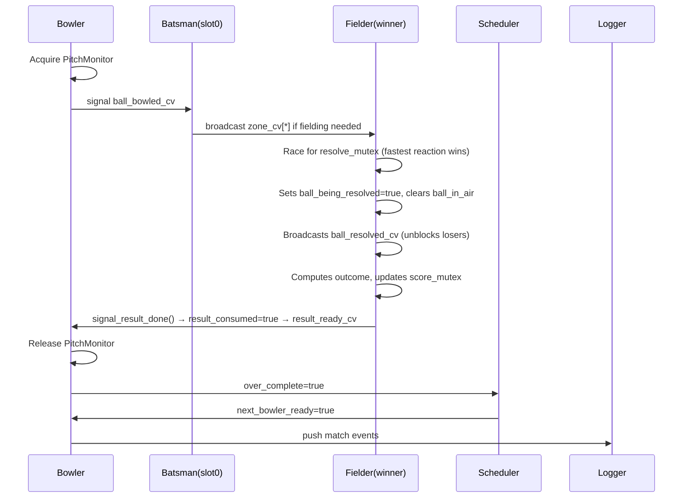
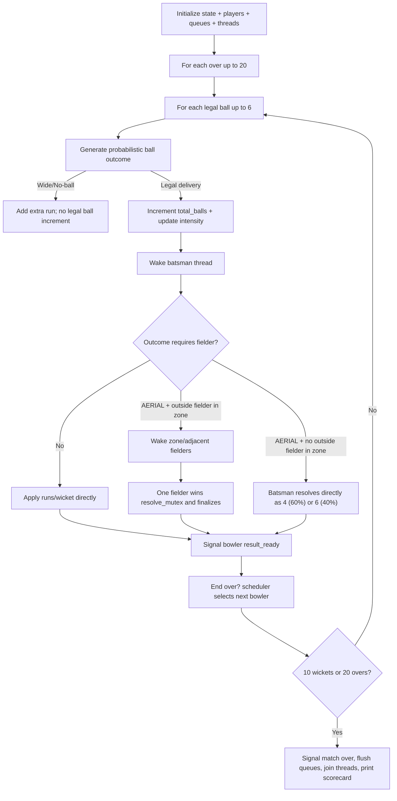
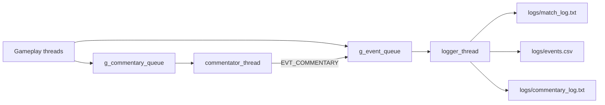

# T20 World Cup Cricket Simulator (India Innings)

A multi-threaded **C++17 + POSIX threads** simulator that models a T20 cricket innings (India batting vs England bowling) as an Operating Systems concurrency problem.

The project maps cricket entities to OS primitives:
- **Players as threads** (bowler, batsmen slots, fielders, umpire, scheduler, logger, commentator)
- **Pitch as critical section**
- **Events as producer-consumer queues**
- **Deadlock detection** with a Banker-style `Available/Allocation/Request` safety check
- **Scheduling** policies (Round Robin phase-quota, SJF, Priority phase-quota)

---

## Table of Contents
- [1. What this simulator models](#1-what-this-simulator-models)
- [2. High-level architecture](#2-high-level-architecture)
- [3. Thread model and synchronization](#3-thread-model-and-synchronization)
- [4. End-to-end innings workflow](#4-end-to-end-innings-workflow)
- [5. Scheduling algorithms](#5-scheduling-algorithms)
- [6. Probability and cricket mechanics model](#6-probability-and-cricket-mechanics-model)
- [7. Deadlock detection design](#7-deadlock-detection-design)
- [8. Logging and analytics pipeline](#8-logging-and-analytics-pipeline)
- [9. Build, run, and analysis](#9-build-run-and-analysis)
- [10. Data structures (core structs)](#10-data-structures-core-structs)
- [11. Assumptions implemented](#11-assumptions-implemented)

---

## 1. What this simulator models

- Single T20 innings (maximum **20 overs** or **10 wickets**).
- India batting lineup of 11 players, England bowling attack of 5 bowlers, and 10 fielders.
- Match flow with realistic outcomes and cricket laws: wides, no-balls, free-hit behavior, catches, run-outs, overthrows, powerplay field restrictions, strike rotation.
- Continuous system-level telemetry through text/CSV/commentary logs.

---

## 2. High-level architecture



### Subsystem map

- **Core state/sync**: `include/match_state.h`, `src/core/match_state.cpp`
- **Event transport**: `include/event.h`, `src/core/event_queue.cpp`
- **Pitch monitor**: `include/pitch_monitor.h`, `src/core/pitch_monitor.cpp`
- **Player model**: `include/player.h`, `src/models/player.cpp`
- **Probabilistic models**: `src/models/ball.cpp`, `src/models/probability_model.cpp`
- **Thread workers**: `src/threads/*.cpp`
- **Entrypoint & roster init**: `src/main.cpp`
- **Post-run analysis**: `analysis/gantt_plot.py`, `analysis/stats_analysis.py`

---

## 3. Thread model and synchronization

### Thread inventory

The simulator runs **18 tracked thread slots**:
- 1 bowler
- 2 batsman slots
- 10 fielders
- 1 scheduler
- 1 umpire
- 1 logger
- 1 commentator
- 1 main

### Synchronization primitives (MatchState)

- `score_mutex`: scoreboard/state updates (`runs`, `wickets`, striker indexes)
- `ball_mutex`: delivery lifecycle flags (`ball_available`, `ball_in_air`, `result_consumed`)
- `sched_mutex` + `sched_cv`: over-end handoff bowler ↔ scheduler
- `zone_cv[ZONE_COUNT]`: zone-based pub-sub wakeup for relevant fielders
- `result_ready_cv` / `ball_resolved_cv`: fielder resolution coordination
- `crease_sem` (capacity 2): two active batsman slots
- `PitchEnd end_mutex[2]`: crease-end lock modeling for run-out state
- `shutdown_mutex` + `shutdown_cv`: orderly umpire final exit gate
- `PitchMonitor::mutex`: pitch critical section (one delivery at a time)

### Thread interaction view



---

## 4. End-to-end innings workflow



---

## 5. Scheduling algorithms

Scheduler is implemented in `src/threads/scheduler_thread.cpp`.

### Bowler scheduling

1. **Round Robin (ALGO_RR)**
   - Implemented as **phase-quota RR**.
   - Over mapping:
     - Overs **1,3** → top-priority bowler
     - Overs **2,4** → second-priority bowler
     - Overs **5,16** → RR excluding top two
     - Overs **17,19** → top-priority bowler
     - Overs **18,20** → second-priority bowler
     - Else → normal RR from current bowler

2. **SJF (ALGO_SJF)**
   - Batsman selection: promotes the batsman with the shortest estimated burst time (`bat_avg / strike_rate × 100`). This is the primary SJF effect.
   - Bowler rotation under SJF: uses standard Round Robin (`rr_next(current, 5)`). SJF is not applied to bowler selection.

3. **Priority (ALGO_PRIORITY)**
   - Uses the same phase-quota routing logic as RR variant, seeded from bowler priorities.

### Batting-order scheduling

- **RR/Priority**: FCFS-like, first waiting and not-called-up batsman.
- **SJF batting order**: chooses batsman with shortest estimated burst:

$$
\text{burst} = \frac{\text{batAvg}}{\text{strikeRate}} \times 100
$$

This SJF burst estimate is used for batting-order selection only.

---

## 6. Probability and cricket mechanics model

### 6.1 Ball outcome distribution

In `src/models/ball.cpp`, each legal delivery samples one of 9 discrete outcomes:

- `DOT`
- `GROUNDED`
- `WELL_TIMED`
- `AERIAL`
- `BOWLED`
- `WIDE`
- `NO_BALL`
- `LBW`
- `STUMPED`

Base weight vector:

$$w = [30, 36, 18, 8, 2, 4, 3, 2, 1]$$

Weights are then adjusted by:
- **Match intensity** (death-over aggression boosts attacking outcomes)
- **Batsman strike rate**
- **Power index**
- **Batting average**
- **Tailender penalty** for lower-order indices

Final outcome is sampled from normalized discrete cumulative weights.

### Match intensity mapping

The bowler thread computes `match_intensity` inline per legal ball as follows:

```cpp
if      (cur_over >= 19) g_match.match_intensity = 10;
else if (cur_over >= 15) g_match.match_intensity = 7;
else if (cur_over >= 10) g_match.match_intensity = 4;
else                     g_match.match_intensity = cur_over / 3;
```

| Current over (0-indexed) | `match_intensity` |
|--------------------------|-------------------|
| ≥ 19 (over 20)           | 10                |
| ≥ 15 (overs 16–19)       | 7                 |
| ≥ 10 (overs 11–15)       | 4                 |
| < 10 (overs 1–10)        | `cur_over / 3` (0–3) |

### 6.2 Aerial-ball fielder resolution

In `src/models/probability_model.cpp`, aerial outcomes are sampled from:

$$[\text{CATCH}, \text{DROP}, \text{RUNOUT}, \text{FOUR}, \text{SIX}] = [8, 10, 12, 38, 32]$$

These weights sum to **100**, so they can be interpreted directly as base percentages
before skill/reaction adjustments $(8 + 10 + 12 + 38 + 32 = 100)$.

Then adjusted by:
- `dive_ability`
- `speed`
- `reaction_ms`

This yields probabilistic but skill-sensitive fielding outcomes.

### 6.3 Run computation for grounded/well-timed balls

`src/threads/fielder_thread.cpp::compute_runs()` derives runs from batting vs fielding scores with additive random noise:
- Batting score uses `power_index`, `strike_rate`, `bat_avg`
- Field score uses `speed`, `accuracy`, `dive_ability`
- Net score bucketed into 0/1/2/3 runs (well-timed adds +1 bias before boundary handling)

### 6.4 Extras and special laws

- **Wide**: +1 run, legal-ball counter unchanged.
- **No-ball**: +1 run, legal-ball counter unchanged, `free_hit_active=true` for next legal delivery.
- **Free hit logic**:
  - protects against: bowled, LBW, stumped
  - catch remains valid (as modeled)
- **Overthrow**: on failed run-out attempt, 20% chance of 1–3 extra runs.
- **Powerplay fielding**:
  - Overs 1–6: only 2 fielders outside 30-yard circle.
  - Overs 7–20: all fielders outside (per current model implementation).

---

## 7. Deadlock detection design

The umpire (`src/threads/umpire_thread.cpp`) polls every **150 ms** and runs a Banker-style safety check over tracked resources.

### Resources tracked

- `SCORE_MUTEX`
- `BALL_MUTEX`
- `SCHED_MUTEX`
- `END_MUTEX_0`
- `END_MUTEX_1`
- `CREASE_SEM` (capacity 2)
- `FIELDER_RESOLVE_MUTEX`
- `PITCH_MONITOR_MUTEX`
- `SHUTDOWN_MUTEX`

### Matrices maintained (`MatchState`)

- `deadlock_allocation[THREAD][RESOURCE]`
- `deadlock_request[THREAD][RESOURCE]`
- `deadlock_available[RESOURCE]`

Each wrapped lock/cond/sem call updates request/allocation bookkeeping.

### On deadlock detection

- Umpire writes `logs/deadlock_log.txt` with trigger info + full matrices/grids.
- Process exits fail-fast with status code `2` (`_Exit(EXIT_CODE_DEADLOCK)`).

### Demo mode

`--deadlock-demo` intentionally creates lock-order inversion between bowler and scheduler to demonstrate detector behavior.
Specifically, bowler acquires `BALL_MUTEX -> SCHED_MUTEX` while scheduler attempts
`SCHED_MUTEX -> BALL_MUTEX`, creating a circular-wait scenario.

---

## 8. Logging and analytics pipeline

### Logging pipeline



### Output artifacts

- `logs/match_log.txt`: structured human-readable event log
- `logs/events.csv`: machine-readable event stream for plotting/statistics
- `logs/commentary_log.txt`: generated narrative commentary
- `logs/deadlock_log.txt`: only when deadlock is detected

### Analysis scripts

- `analysis/gantt_plot.py` → thread/event timeline plots
- `analysis/stats_analysis.py` → comparative run statistics (e.g., FCFS vs SJF)

---

## 9. Build, run, and analysis

### Build

```bash
cd <project-root>
make
```

### Run modes

```bash
# Dual run: calls fork()+execl() twice (once with --fcfs, once with --sjf).
# After each child exits (waitpid), the parent copies events.csv, match_log.txt,
# and commentary_log.txt to events_fcfs.csv / events_sjf.csv etc.
# Intermediate files are deleted after copying.
./t20_simulator

./t20_simulator --fcfs          # single fcfs run
./t20_simulator --sjf         # single SJF run
./t20_simulator --deadlock-demo
```

### Generate plots

```bash
make analysis
```

Expected plot outputs:
- `docs/gantt_fcfs.png`
- `docs/gantt_sjf.png`
- `docs/analysis.png`

---

## 10. Data structures (core structs)

### `Player` (include/player.h)

Contains:
- Identity: `id`, `name`, `role`
- Batting stats: `runs_scored`, `balls_faced`, `fours`, `sixes`, `is_out`, `out_type`
- Bowling stats: `balls_bowled`, `runs_given`, `wickets_taken`, `overs_bowled`
- Scheduler metadata: `priority`, `estimated_duration`, `crease_order`, `called_up`
  - `crease_order`: set to `g_crease_counter++` at the moment the player walks to the crease (via `batsman_thread` on direct wickets, or `fielder_thread` via `bring_new_batsman()` on caught/run-out). Openers get order 1 and 2 at init; `g_crease_counter` starts at 3.
- Skill vectors:
  - Batting: `bat_avg`, `strike_rate`, `power_index`
  - Fielding: `dive_ability`, `accuracy`, `speed`
- Positioning: `field_zone`, `in30YardZone`

### `MatchState` (include/match_state.h)

Global shared state containing:
- Scoreboard counters (`runs`, `wickets`, `over`, `ball`, `total_balls`)
- Striker/non-striker pointers and batting progression
- All mutexes/CVs/semaphores
- Scheduler handoff and mode fields
- Free-hit and ball-state flags
- Deadlock accounting matrices and thread/resource metadata
- Match intensity and current bowler indices

### `Event` and `EventQueue` (include/event.h)

- `Event`: typed event payload with actor IDs, run info, ball coordinates, zone, and text message.
- `EventQueue`: bounded circular buffer (`capacity=256`) with mutex + `not_empty`/`not_full` CVs and shutdown semantics.

---

## 11. Assumptions implemented

1. **Single innings only** (India batting).
2. **Fixed rosters**: 11 batsmen, 5 bowlers, 10 fielders.
3. **Simulated clock via `usleep()`** for pacing.
4. **Two permanent batsman thread slots.** Slot 0 (striker) processes all ball outcomes. Slot 1 (non-striker) wakes on `ball_bowled_cv`, finds `thread_slot != 0`, releases `ball_mutex`, sleeps 20 ms, and loops. The non-striker never calls any outcome-processing code.
5. **Persistent fielder threads** awakened by zone-based condition broadcasts.
6. **Periodic deadlock polling** by umpire every 150 ms.
7. **Discrete weighted probability model** for ball and fielding outcomes.
8. **Time-invariant skill parameters** per player during innings.
9. **Overthrow probability fixed at 20%** for failed run-out path.
10. **Powerplay field restrictions**: Overs 1–6: fielders 0 (J. Roy, Cover) and 8 (T. Banton, Square Leg) placed outside the 30-yard circle; remaining 8 inside (`in30YardZone = true`). Overs 7–20: all 10 fielders set to `in30YardZone = false`. Updated per legal ball inside the bowler thread under `ball_mutex`.

---

## Notes

This repository is intentionally designed as an **OS-concepts-to-domain mapping** project. Its strongest value is not only cricket simulation, but also demonstrable patterns in:
- lock ordering and contention
- producer-consumer pipelines
- scheduling policy comparison
- deadlock detection and fail-fast recovery behavior
