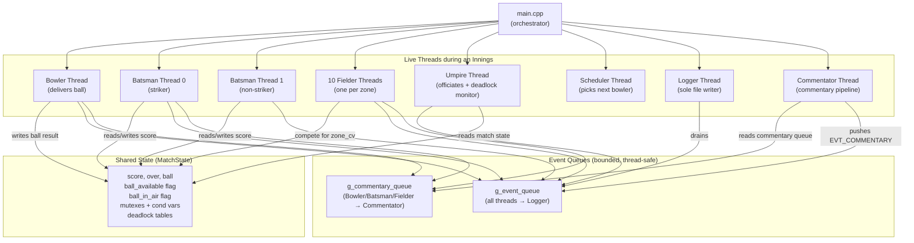
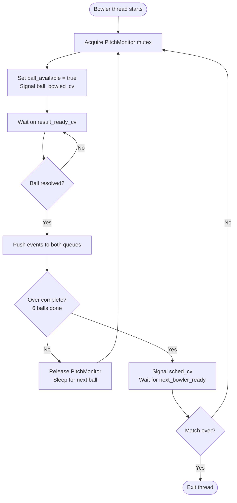
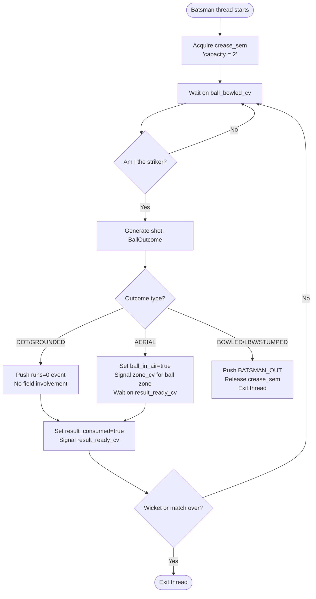
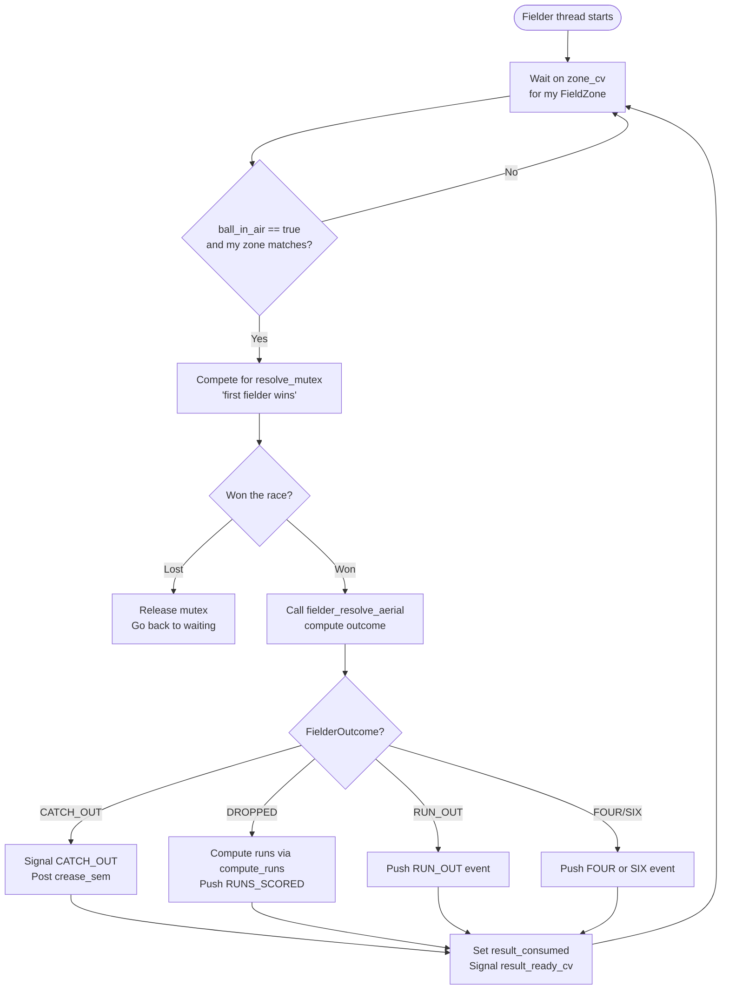
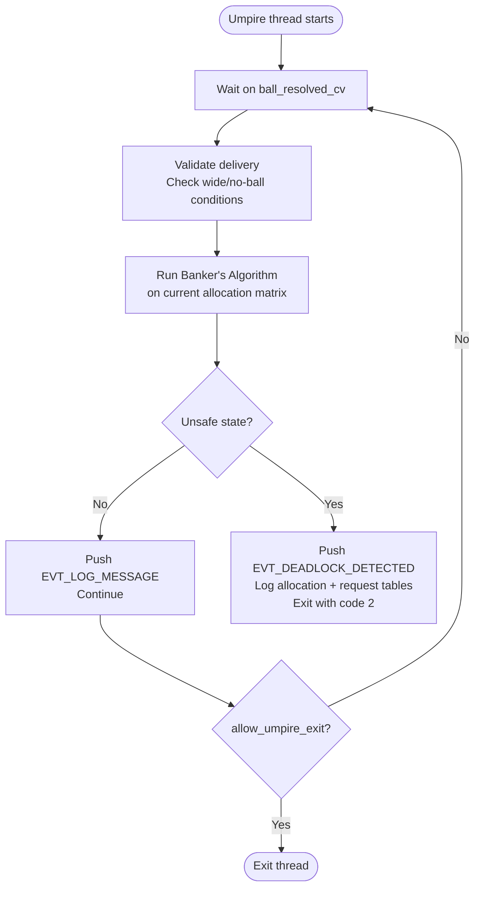
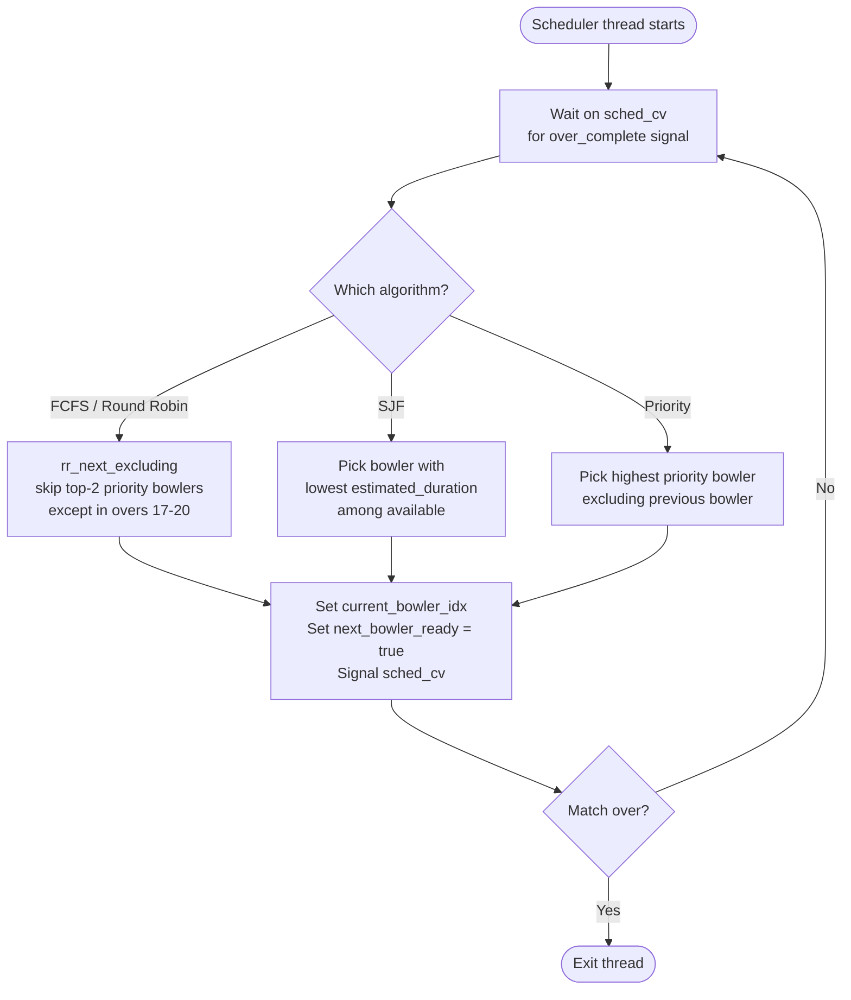
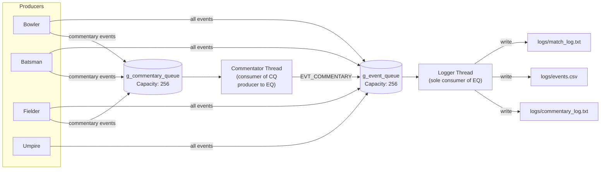
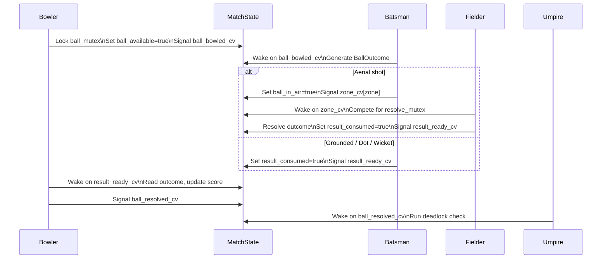
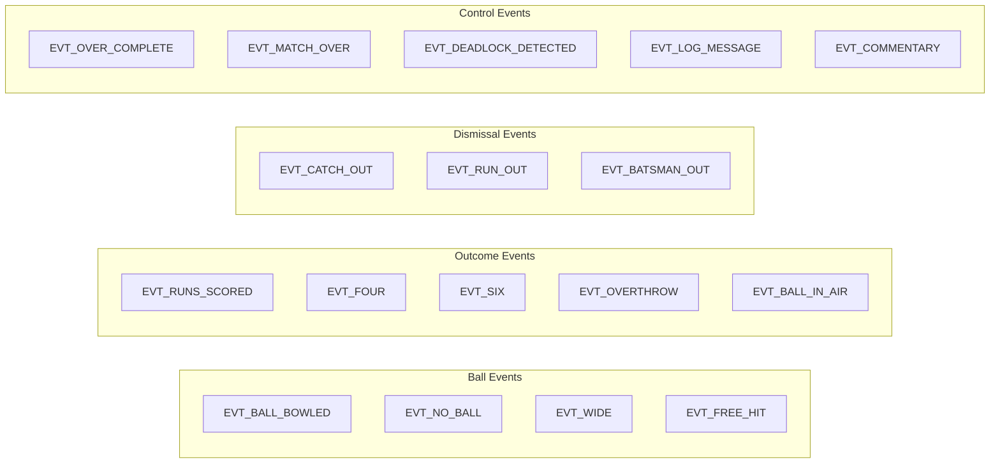
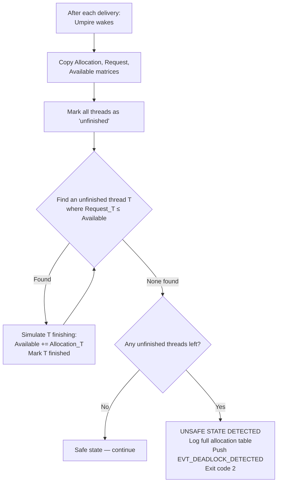

#  Multithreaded T20 Cricket World Cup Simulator

> 
> **Language:** C++17 with POSIX Threads  
> **Match:** India 🇮🇳 vs England 🏴󠁧󠁢󠁥󠁮󠁧󠁿 — T20 World Cup Final

A full two-innings T20 cricket match simulated entirely via concurrent OS-level threads. Every player on the pitch is a live thread. Every ball is a synchronised event. Scheduling algorithms, deadlock detection, and inter-thread communication are all demonstrated in the context of a real cricket match.

---

## Table of Contents

1. [Project Overview](#1-project-overview)
2. [Repository Structure](#2-repository-structure)
3. [Architecture Overview](#3-architecture-overview)
4. [Thread Design](#4-thread-design)
5. [Synchronisation & Concurrency](#5-synchronisation--concurrency)
6. [Scheduling Algorithms](#6-scheduling-algorithms)
7. [Event System](#7-event-system)
8. [Deadlock Detection](#8-deadlock-detection)
9. [Probability & Simulation Models](#9-probability--simulation-models)
10. [Output & Logging](#10-output--logging)
11. [Analysis Tools](#11-analysis-tools)
12. [Build & Run](#12-build--run)
13. [Key OS Concepts Demonstrated](#13-key-os-concepts-demonstrated)

---

## 1. Project Overview

This simulator maps a cricket T20 match onto operating systems concepts:

| Cricket Role | OS Concept |
|---|---|
| Batsman | User-space thread waiting on a resource (the ball) |
| Bowler | Thread that produces a shared resource (ball delivery) |
| Fielder | 10 concurrent threads competing for the same event (aerial ball) |
| Umpire | Monitor/watchdog thread — also runs the deadlock detector |
| Scheduler | Thread that implements CPU scheduling algorithms for bowler rotation |
| Logger | Single-writer consumer draining the shared event queue |
| Commentator | Pipeline stage: consumes one queue, produces to another |

The full match runs two innings. Between them, teams swap roles. The final result (win/loss/tie) is printed after both innings complete.

---

## 2. Repository Structure

```
.
├── include/
│   ├── event.h           # Event types, EventQueue struct, queue API
│   ├── match_state.h     # MatchState (shared scoreboard + all sync primitives)
│   ├── player.h          # Player struct, FieldZone enum, role definitions
│   ├── pitch_monitor.h   # PitchMonitor (mutex protecting the crease)
│   ├── scheduler.h       # Scheduler API declarations
│   └── scoreboard.h      # Live scoreboard print helpers
│
├── src/
│   ├── main.cpp                    # Entry point, thread launch/join, innings loop
│   ├── core/
│   │   ├── match_state.cpp         # MatchState init/destroy + deadlock helpers
│   │   ├── event_queue.cpp         # Bounded circular buffer with mutex+cond
│   │   ├── pitch_monitor.cpp       # Pitch mutex acquire/release
│   │   └── scoreboard.cpp          # Live terminal scoreboard rendering
│   ├── threads/
│   │   ├── bowler_thread.cpp       # Delivers balls, manages overs
│   │   ├── batsman_thread.cpp      # Faces balls, decides shot, scores runs
│   │   ├── fielder_thread.cpp      # Reacts to aerial balls, attempts catches/run-outs
│   │   ├── umpire_thread.cpp       # Officiates, runs Banker's Algorithm deadlock detector
│   │   ├── scheduler_thread.cpp    # Selects next bowler via FCFS/SJF/Priority
│   │   ├── logger_thread.cpp       # Single writer to match_log.txt + events.csv
│   │   └── commentator_thread.cpp  # Generates rich commentary, pipeline producer/consumer
│   ├── models/
│   │   ├── ball.cpp                # Ball outcome probability model
│   │   └── probability_model.cpp   # Fielder outcome probability model
│   └── utils/
│       ├── random.cpp              # Weighted random selection helper
│       └── time_utils.cpp          # Monotonic timestamp helper
│
├── analysis/
│   ├── gantt_plot.py       # Gantt chart generator (per-ball event timeline)
│   └── stats_analysis.py   # Full statistical comparison across scheduler modes
│
├── logs/                   # Generated at runtime (git-ignored)
└── Makefile
```

---

## 3. Architecture Overview



---

## 4. Thread Design

### 4.1 Bowler Thread

The bowler is the **clock** of the simulation. Each iteration represents one ball delivery.



**Powerplay enforcement:** During overs 1–6, fielders at `COVER` (index 0) and `SQUARE_LEG` (index 8) are forced inside the 30-yard circle. The bowler thread enforces this by directly setting `in30YardZone` on those two fielder objects before each delivery.

---

### 4.2 Batsman Threads

Two batsman threads run simultaneously — striker and non-striker. Only the **striker** resolves the ball outcome; the non-striker watches for run-out opportunities.



**Shot probability** is weighted by the batsman's `strike_rate`, `bat_avg`, and `power_index`. Higher-rated batsmen get boosted weights for `WELL_TIMED` and `AERIAL` outcomes and reduced weight for `BOWLED`/`LBW`.

---

### 4.3 Fielder Threads (×10)

Each fielder lives in a specific `FieldZone`. All 10 threads run concurrently and only become active when the ball enters their zone.



**Zone adjacency:** If the ball lands in a zone adjacent to a fielder's assigned zone (within ±1 in circular order), that fielder is still eligible to attempt the ball. This models realistic diving/running between positions.

---

### 4.4 Umpire Thread

The umpire thread has two responsibilities:

1. **Ball validation** — confirms each delivery, handles no-ball/wide rule enforcement
2. **Deadlock detection** — runs the Banker's Algorithm after every delivery



---

### 4.5 Scheduler Thread



**Death over specialisation (overs 17–20):** Under all algorithms, the two highest-`priority` bowlers are reserved for death overs. The scheduler pre-computes these two indices at the start of the innings and always selects between them in the final four overs.

---

### 4.6 Logger & Commentator Threads



The logger is the **only** thread permitted to write to disk, eliminating all file-write races.

---

## 5. Synchronisation & Concurrency

### Primitives in use

| Primitive | Used for |
|---|---|
| `pthread_mutex_t score_mutex` | Protect score, over, ball counters |
| `pthread_mutex_t ball_mutex` | Protect `ball_available`, `ball_in_air`, `result_consumed` |
| `pthread_mutex_t sched_mutex` | Protect scheduler state (`over_complete`, `next_bowler_ready`) |
| `pthread_mutex_t shutdown_mutex` | Coordinate graceful thread shutdown |
| `pthread_mutex_t resolve_mutex` | Ensure only one fielder resolves an aerial ball |
| `pthread_mutex_t deadlock_mutex` | Protect Banker's Algorithm tables |
| `pthread_cond_t ball_bowled_cv` | Batsmen wake when a ball is delivered |
| `pthread_cond_t zone_cv[8]` | One condition per FieldZone; fielders wake only for their zone |
| `pthread_cond_t result_ready_cv` | Bowler wakes when ball outcome is resolved |
| `pthread_cond_t ball_resolved_cv` | Umpire wakes after each delivery |
| `pthread_cond_t sched_cv` | Scheduler wakes at end of each over |
| `sem_t crease_sem` | Counting semaphore (capacity=2) — exactly two batsmen on crease |
| `EventQueue.mutex + not_empty + not_full` | Classic bounded-buffer producer-consumer |

### Ball lifecycle (per delivery)



---

## 6. Scheduling Algorithms

The simulator demonstrates three CPU-scheduling algorithms applied to **bowler selection**:

### FCFS / Round-Robin (Phase Quota)

Each bowler gets turns in sequence. The top-2 priority bowlers are held back until overs 17–20 (death overs). Outside death overs, `rr_next_excluding` cycles through the remaining three bowlers.

```
Overs 1–16:  Bowler[0] → Bowler[1] → Bowler[2] → Bowler[0] → ...
             (skipping top-2 priority bowlers)
Overs 17–20: Bowler[top1] → Bowler[top2] → Bowler[top1] → ...
```

### Shortest Job First (SJF)

Each bowler carries an `estimated_duration` (proxy for balls-to-wicket). The scheduler picks the bowler with the **lowest** estimated duration among those not currently bowling. If two are equal, lower index wins.

```
Priority: min(estimated_duration) among available bowlers
```

### Priority Scheduling

Each bowler has an integer `priority` (higher = better). The scheduler selects the highest-priority bowler who is not the same as the previous bowler (to avoid consecutive overs). The top-2 priority bowlers are still reserved for death overs under this mode.

---

## 7. Event System

### Event Types



### EventQueue — Bounded Circular Buffer

```
Capacity: 256 events (EVENT_QUEUE_CAPACITY)

  head →  [ E0 | E1 | E2 | ... | E255 ]  ← tail
           ↑ consumer pops here          ↑ producer pushes here

Mutex:     queue.mutex
Wake producer: not_full  (signal when count < 256)
Wake consumer: not_empty (signal when count > 0)
Shutdown:  queue.shutdown flag — unblocks all waiters
```

Every push/pop is wrapped in `pthread_mutex_lock` + `pthread_cond_wait` to guarantee thread safety and prevent busy-waiting.

---

## 8. Deadlock Detection

The umpire thread implements the **Banker's Algorithm** (resource-allocation graph variant) after every delivery.

### Resources tracked (9 total)

| ID | Resource |
|---|---|
| 0 | `SCORE_MUTEX` |
| 1 | `BALL_MUTEX` |
| 2 | `SCHED_MUTEX` |
| 3 | `END_MUTEX_0` |
| 4 | `END_MUTEX_1` |
| 5 | `CREASE_SEM` (capacity=2) |
| 6 | `FIELDER_RESOLVE_MUTEX` |
| 7 | `PITCH_MONITOR_MUTEX` |
| 8 | `SHUTDOWN_MUTEX` |

### Threads tracked (18 total)

1 Bowler + 2 Batsmen + 10 Fielders + 1 Umpire + 1 Scheduler + 1 Logger + 1 Commentator + 1 Main

### Algorithm flow



**Demo mode:** Run with `--deadlock-demo` to inject artificially high resource contention, making a deadlock-detection event very likely within the first few overs.

---

## 9. Probability & Simulation Models

### Ball Outcome Model (`src/models/ball.cpp`)

Base weights over 9 outcomes:

| Outcome | Base Weight | Notes |
|---|---|---|
| DOT | 30 | Reduced by `match_intensity / 2` in death overs |
| GROUNDED | 36 | Standard ground shot for 1–3 runs |
| WELL_TIMED | 18 | Increased by `match_intensity` |
| AERIAL | 8 | Slight boost in high-intensity phases |
| BOWLED | 2 | — |
| WIDE | 4 | — |
| NO_BALL | 3 | — |
| LBW | 2 | — |
| STUMPED | 1 | — |

Batsman stats (`strike_rate`, `power_index`, `bat_avg`) then shift these weights individually. A batsman with `power_index ≥ 8` gets a large AERIAL/WELL_TIMED boost and a BOWLED/STUMPED reduction.

### Fielder Outcome Model (`src/models/probability_model.cpp`)

Base weights for aerial ball:

| Outcome | Base Weight |
|---|---|
| CATCH_OUT | 8 |
| DROPPED | 10 |
| RUN_OUT_ATTEMPT | 12 |
| FOUR (over boundary) | 38 |
| SIX (over boundary) | 32 |

Modified by `dive_ability`, `speed`, and `reaction_ms`. A fielder with `dive_ability ≥ 8` gains +12 to CATCH weight. Faster reaction time reduces FOUR/SIX weights.

### Run Computation (`src/threads/fielder_thread.cpp`)

```
batting_score = power_index × 0.5 + (strike_rate / 100) × 3.0 + (bat_avg / 50) × 2.0
field_score   = speed × 0.5 + accuracy × 0.3 + dive_ability × 0.4
net           = batting_score − field_score + noise(−1, +1)

net < −1.0  → 0 runs
net < 1.5   → 1 run
net < 3.0   → 2 runs
net < 4.5   → 3 runs
net ≥ 4.5   → 4 runs (boundary)
```

---

## 10. Output & Logging

Three log files are written to `logs/` during a run:

| File | Contents |
|---|---|
| `logs/match_log.txt` | Human-readable ball-by-ball log with timestamps |
| `logs/events.csv` | Structured CSV: `timestamp_us, event_type, over, ball, bowler_id, batsman_id, fielder_id, runs` |
| `logs/commentary_log.txt` | Rich auto-generated commentary lines |

When run without a flag (default mode), the simulator forks and runs **three separate child processes** (FCFS, SJF, Priority), saving their CSV outputs as:
- `logs/events_fcfs.csv`
- `logs/events_sjf.csv`
- `logs/events_priority.csv`

These three files feed the analysis scripts.

---

## 11. Analysis Tools

### Gantt Chart (`analysis/gantt_plot.py`)

Reads the two or three CSV files and plots a Gantt-style chart: each row is a ball delivery, coloured by match phase (Powerplay / Middle / Death). Saves to `docs/gantt_fcfs.png`, `docs/gantt_sjf.png`.

### Stats Analysis (`analysis/stats_analysis.py`)

Generates a multi-panel matplotlib figure comparing FCFS vs SJF vs Priority across:

- Run rate progression per over
- Wicket distribution by type (caught, bowled, LBW, run-out, stumped)
- Boundary count (fours vs sixes) per phase
- Dismissal colour map

Output saved to `docs/analysis.png`.

**Dependencies:**
```bash
pip install matplotlib pandas numpy
```

---

## 12. Build & Run

### Prerequisites

- `g++` with C++17 support
- POSIX threads (`-lpthread`) — standard on Linux/macOS
- Python 3.8+ with `matplotlib`, `pandas`, `numpy` (for analysis only)

### Build

```bash
make          # Compiles all sources → ./t20_simulator
```

### Run

```bash
# Default: forks 3 child processes (FCFS + SJF + Priority), saves all CSVs
./t20_simulator

# Single-algorithm runs
./t20_simulator --fcfs          # Round-robin bowler scheduling
./t20_simulator --sjf           # Shortest Job First bowler scheduling
./t20_simulator --priority      # Priority-based bowler scheduling

# Deadlock demo: high-contention mode to trigger Banker's Algorithm detection
./t20_simulator --deadlock-demo

# Makefile shortcuts
make run          # build + run --fcfs
make run-sjf      # build + run --sjf
```

### Generate analysis charts

```bash
make analysis
# Produces:
#   docs/gantt_fcfs.png
#   docs/gantt_sjf.png
#   docs/analysis.png
```

### Clean

```bash
make clean    # removes build/, t20_simulator, logs/*.csv, logs/*.txt, docs/*.png
```

---

## 13. Key OS Concepts Demonstrated

| Concept | Where it appears |
|---|---|
| **POSIX Threads** | All 7+ threads per innings via `pthread_create` / `pthread_join` |
| **Mutex + Condition Variables** | Ball lifecycle, score updates, scheduler handoff, shutdown |
| **Counting Semaphore** | `crease_sem` — exactly 2 batsmen on crease at all times |
| **Producer-Consumer Pattern** | `EventQueue` (bounded circular buffer, 256 capacity) |
| **Pipeline Message-Passing** | Commentator consumes `g_commentary_queue`, produces to `g_event_queue` |
| **Banker's Algorithm** | Umpire thread runs safety check after every delivery |
| **CPU Scheduling Algorithms** | FCFS/Round-Robin, SJF, Priority — applied to bowler rotation |
| **Fork / Exec** | `main.cpp` forks child processes for multi-algorithm comparison runs |
| **Race Condition Prevention** | `resolve_mutex` ensures only one fielder resolves an aerial ball |
| **Monitor Pattern** | `PitchMonitor` wraps crease mutex with acquire/release semantics |
| **Single-Writer Logging** | Logger is sole thread writing to disk — no concurrent file access |

---

*Simulation is stochastic — no two matches are identical.*
